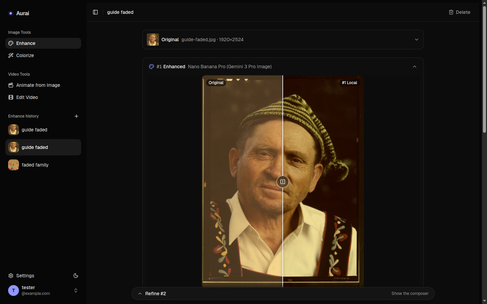
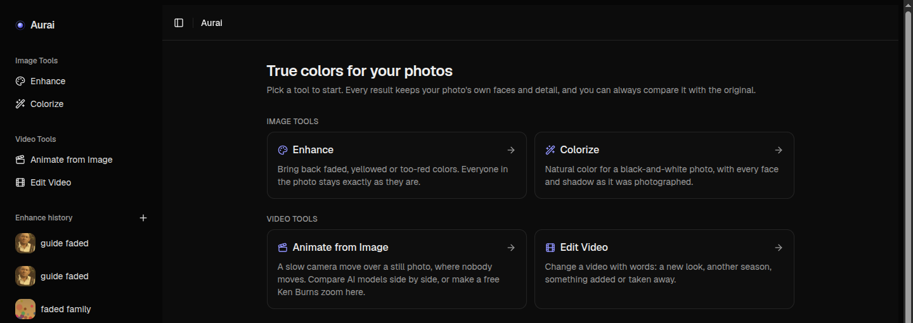
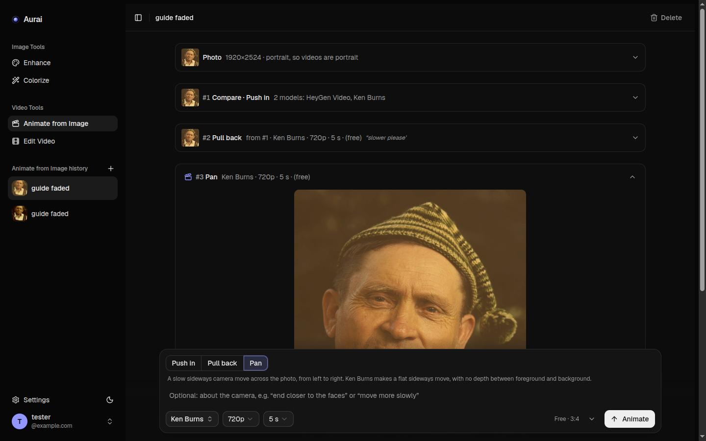
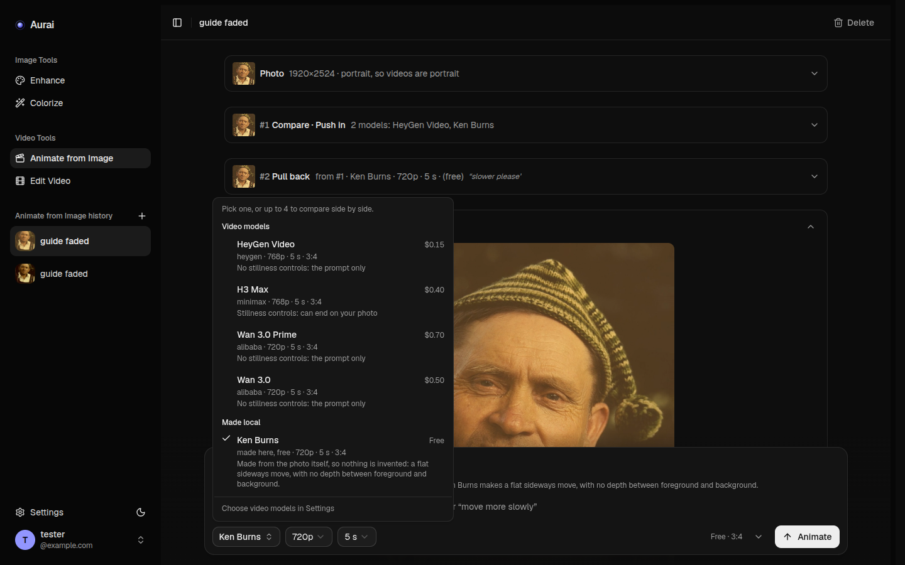

# Aurai

A self-hosted web app that brings old photos back to life using AI. It fixes faded and yellowed colors,
colorizes black-and-white pictures, and turns a photo into a short video. It can also change a
video with a simple sentence.

This is a small project I wanted to create to use Openrouter image and video AI models in a small contained environment. Feel free to create a PR and add more features.



## What it does

- **Enhance** — faded, yellowed or too-red photos get their natural colors back. The people in
  the photo stay exactly as they are: Aurai keeps your own pixels and only takes the colors from
  the AI, so no face is redrawn.
- **Colorize** — natural colors for black-and-white photos, with every face and shadow as it was.
- **Repair** — removes scratches, dust, creases and small tears. Only the damaged spots change;
  the rest of the photo stays your own.
- **Upscale** — makes a small photo bigger and sharper, up to 4K. The shapes and colors stay your
  photo's own, and the AI only adds finer detail. You can also just resize it, for free.
- **Animate from Image** — a slow camera move over a still photo, where nobody moves. Try several
  AI models side by side, or make a free Ken Burns zoom on your own server.
- **Edit Video** — upload a short clip and write what to change: "make it a snowy winter day".
- Before/after slider, small fixes like "a little warmer skin", downloads in full size.
- Send a result on to the next tool: repair a photo, colorize it, upscale it, then animate it.
- A history of everything you made. You see the price of a run before you start it, whenever
  OpenRouter publishes one.
- Sign in with a code sent by email. No passwords.

The AI work is done by models on [OpenRouter](https://openrouter.ai). Each person connects their
own OpenRouter account in Settings and pays OpenRouter directly. The Ken Burns videos are made on
your server and are free.



Pick a camera move and a model — or several, to see them side by side:





## Running it

You need Docker and an `.env` file:

```bash
cp .env.example .env
```

Open `.env` and fill in two secrets, `AUTH_SECRET` and `ENCRYPTION_KEY`. They must be different.
This makes a good one:

```bash
openssl rand -base64 32
```

Set `SITE_URL` to the address you will open Aurai at, for example `https://photos.example.com`.

Then:

```bash
mkdir -p data
docker compose up -d
```

It listens on port 3000. Open it, sign in with your email, and connect OpenRouter on the
Settings page. That's it.

**The `data` folder must be writable by the container**, which runs as user 1000. If the log
says it cannot open the database, run:

```bash
sudo chown -R 1000:1000 data
```

### Without compose

```bash
docker run -d --name aurai -p 3000:3000 \
  -v "$PWD/data:/app/data" \
  --env-file .env \
  ghcr.io/meceware/aurai:latest
```

### Sign-in emails

Without an email server, the sign-in code is printed to the container log. For one or two people
that is enough:

```bash
docker logs aurai
```

To send real emails, fill in the `EMAIL_SERVER_*` and `EMAIL_FROM` lines in `.env`.

### Settings in `.env`

| Setting | Needed | What it is for |
|---|---|---|
| `AUTH_SECRET` | yes | Any long random text. Changing it signs everyone out. |
| `ENCRYPTION_KEY` | yes | Protects the OpenRouter keys saved in the database. Keep it safe; without it, saved keys cannot be read. |
| `SITE_URL` | yes | The address you open Aurai at, no `/` at the end. |
| `EMAIL_SERVER_HOST`, `EMAIL_SERVER_PORT`, `EMAIL_SERVER_USER`, `EMAIL_SERVER_PASSWORD`, `EMAIL_FROM` | no | Your SMTP server, for sign-in emails. |
| `SIGNUP_ENABLED` | no | `false` stops new accounts. Your own account keeps working. |
| `ALLOWED_EMAIL_DOMAINS` | no | Only these email domains can sign up, for example `example.com`. |
| `MAX_USERS` | no | The most accounts there can be. `0` means no limit. |
| `USER_QUOTA_MB` | no | Storage for each person, 2048 MB by default. |
| `TURNSTILE_SITE_KEY`, `TURNSTILE_SECRET_KEY` | no | Cloudflare Turnstile on the sign-in page, against bots. |

## Putting it online

Aurai is one container and needs nothing else in front of it. Point your tunnel or reverse proxy
at port 3000 — Cloudflare Tunnel, Nginx Proxy Manager, Caddy, whatever you already use — and set
`SITE_URL` to the public `https://` address.

An HTTPS address matters for two things:

- **Edit Video** works only with it. OpenRouter does not take a video inside the request, so it
  downloads it from Aurai, through a private link that works only while that edit is being made.
- **Videos finish sooner on screen.** OpenRouter tells Aurai the moment a video is ready, instead
  of Aurai checking every now and then.

Anyone who can open the sign-in page can make an account. After you make yours, you may want
`SIGNUP_ENABLED=false`, or `ALLOWED_EMAIL_DOMAINS`, or Cloudflare Access in front of it.

Uploads are limited to 30 MB for photos and 90 MB for videos. That is under the 100 MB that
Cloudflare lets through on its free plan.

## Backups

Everything lives in the `data` folder: the database, and the photos and videos as normal files.
To take a backup while Aurai is running:

```bash
docker exec aurai node scripts/backup.js
```

This writes a safe copy of the database to `data/backups` (the last 14 are kept). Then copy the
whole `data` folder somewhere else. A backup is only a backup once you have tried to restore it.

## Accounts

```bash
docker exec aurai node scripts/admin.js users
docker exec aurai node scripts/admin.js delete someone@example.com --yes
```

Deleting an account removes all of its photos and videos too. People can also delete their own
account in Settings.

## Updating

```bash
docker compose pull
docker compose up -d
```

The database is updated on start. Images for amd64 and arm64 are published to `ghcr.io` on every
push to `main` and on every `v*` tag.

## Building the image yourself

```bash
docker build -t aurai .
docker run -d --name aurai -p 3000:3000 -v "$PWD/data:/app/data" --env-file .env aurai
```

## Development

You need Node 24 and ffmpeg.

```bash
npm ci
cp .env.example .env.local
npm run dev
```

Sign-in codes go to the terminal, and to `data/dev-outbox.log`. To try everything without paying
for AI runs, set `OPENROUTER_MOCK=true` in `.env.local`: the AI results are then fake ones.

`npm test` runs the tests, `npm run lint` checks the code.

## Built with

- [Next.js](https://nextjs.org)
- [SQLite](https://sqlite.org) via [better-sqlite3](https://github.com/WiseLibs/better-sqlite3)
- [sharp](https://sharp.pixelplumbing.com) for photos and [FFmpeg](https://ffmpeg.org) for videos
- [Tailwind CSS](https://tailwindcss.com) + [shadcn/ui](https://ui.shadcn.com), with [Lucide](https://lucide.dev) icons
- [Better Auth](https://www.better-auth.com)
- [OpenRouter](https://openrouter.ai) for the AI models

The photo in the screenshots is *Guide at Little Norway, Blue Mounds, Wis.* by Arthur Rothstein
(1942), from the [Library of Congress](https://lccn.loc.gov/2017878934). It is in the
public domain; I faded it on purpose to show the restoration.
